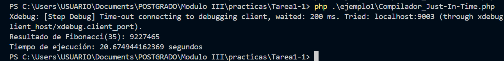

# Ejemplo 1

## Compilador Just-In-Time (JIT) - PHP 8.0

| Aspecto     | Descripción |
|------------|------|
| Explicación Técnica           | El JIT es un motor de compilación que, en lugar de solo interpretar el código (como hacía PHP históricamente), compila partes del código OPcode en código máquina nativo en tiempo de ejecución. Esto almacena y reutiliza el código compilado en la caché de OPcache. Es más beneficioso para el código que realiza cálculos intensivos (computación científica, gráficos, machine learning), ofreciendo un rendimiento comparable al de lenguajes compilados.  |
| Beneficios       | Rendimiento significativamente mejorado en cargas de trabajo de CPU intensivas. Potencial para nuevos dominios de aplicación para PHP.   |
| Riesgo    | Impacto limitado en el rendimiento de aplicaciones web típicas (I/O Bound). Consume más memoria debido al buffer del JIT.   |
| Impacto Practico    | Rendimiento: Acelera la ejecución de cálculos complejos. Calidad/Seguridad: Indirecto, al liberar recursos para tareas críticas.   |

### Code

```php
<?php // PHP 8.0+
function fibonacci(int $n): int
{
    if ($n <= 1) {
        return $n;
    }
    return fibonacci($n - 1) + fibonacci($n - 2);
}

$start = microtime(true);
$result = fibonacci(35);
$end = microtime(true);

echo "Resultado de Fibonacci(35): " . $result . "\n";
echo "Tiempo de ejecución: " . ($end - $start) . " segundos\n";

```

### Salida del ejercicio.


