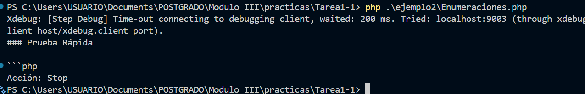

# Ejemplo 2

## Enumeraciones (Enums) - PHP 8.1

| Aspecto     | Descripción |
|------------|------|
| Explicacion tecnica        | Los Enums permiten definir un tipo de dato con un conjunto finito de valores posibles (casos). Reemplazan el uso de constantes de clase, arrays o cadenas mágicas para representar estados o tipos fijos, aportando una seguridad de tipos superior.   |
| Beneficios       | Seguridad de Tipos estricta, código más legible y auto-documentado, y facilita el uso de la expresión match.   |
| Riesgos    | No aplicable a todos los escenarios, solo cuando los valores posibles son fijos y conocidos.   |
| Impacto Practico    | Calidad y Seguridad: Elimina el riesgo de errores tipográficos al pasar un estado no válido a una función (cadenas mágicas). El código se auto-documenta mejor gracias al tipado.   |

## Antes vs. Después (Mejora del Código)

Antes (Pre-PHP 8.1 - Uso de Constantes o Cadenas)	Después (PHP 8.1+ - Uso de Enum)
```php	
class Order {	
const STATUS_PENDING = 'PENDING';	
const STATUS_SHIPPED = 'SHIPPED';	
const STATUS_DELIVERED = 'DELIVERED';
```
```php
public function setStatus(string $status): void {
    // Validación manual o nula: si se pasa 'Pending' (con mayúscula inicial), falla.
}
```
```php
} $order->setStatus('PENDING'); // Funciona $order->setStatus('PENDING_'); // Error silencioso/runtime |php enum OrderStatus: string { case PENDING = 'PENDING'; case SHIPPED = 'SHIPPED'; case DELIVERED = 'DELIVERED'; }
```
```php
class Order { public function setStatus(OrderStatus $status): void { // Tipado estricto asegura un valor válido } } $order->setStatus(OrderStatus::PENDING); // OK // $order->setStatus('PENDING'); // ¡Error de tipo en tiempo de ejecución!
```

### Code

```php
<?php 
enum TrafficLight: string
{
    case RED = 'Stop';
    case YELLOW = 'Caution';
    case GREEN = 'Go';
}

function getAction(TrafficLight $light): string
{
    return $light->value;
}

$action = getAction(TrafficLight::RED);
assert($action === 'Stop');
echo "Acción: " . $action . "\n";
?>
```
### Salida del ejercicio




