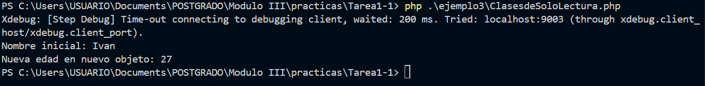

# Ejemplo 3

## Clases de Solo Lectura (Readonly Classes) - PHP 8.2

| Aspecto     | Descripción |
|------------|------|
| Explicación Técnica        | Permite declarar una clase completa con la palabra clave readonly. Esto automáticamente hace que todas sus propiedades sean de solo lectura (una vez inicializadas en el constructor, no pueden ser modificadas). Esto es ideal para la creación de objetos de valor (Value Objects) y DTOs (Data Transfer Objects) que representan datos inmutables.   |
| Beneficios       | Garantiza la inmutabilidad del objeto y sus propiedades, mejorando la calidad y seguridad del código al prevenir modificaciones accidentales fuera del constructor.   |
| Riesgos    | No se puede aplicar a traits o interfaces. No permite propiedades estáticas.   |
| Impacto Práctico    | Seguridad y Calidad: Fuerza la inmutabilidad de los objetos, una práctica fundamental en la programación orientada a objetos para evitar estados inconsistentes y efectos secundarios inesperados.   |

### Antes vs. Después (Mejora del Código Legado)

Antes (PHP 8.1 - Propiedades readonly individuales)	Después (PHP 8.2+ - Clase readonly)
```php
class Coordinates {
public readonly float $lat;
public readonly float $lon;
```

```php
public function __construct(float $lat, float $lon) {
    $this->lat = $lat;
    $this->lon = $lon;
}
```

} |php readonly class Coordinates { // La palabra clave 'readonly' ya no es necesaria en las propiedades individuales public float $lat; public float $lon;

```php
public function __construct(float $lat, float $lon) {
    $this->lat = $lat;
    $this->lon = $lon;
}
```
### Code
```php
<?php // PHP 8.2+
readonly class UserData {
    public string $name;
    public int $age;
    public function __construct(string $name, int $age) {
        $this->name = $name;
        $this->age = $age;
    }
    public function withAge(int $age): self {
        return new self($this->name, $age);
    }
}

$user = new UserData("Ivan", 26);
echo "Nombre inicial: " . $user->name . "\n";

$user2 = $user->withAge(27);
echo "Nueva edad en nuevo objeto: " . $user2->age . "\n";

```
### Resultado de la salida



