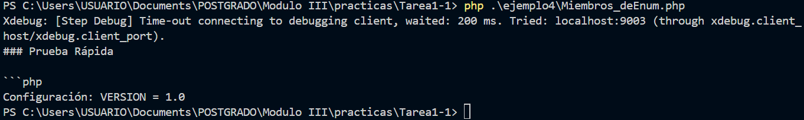

# Ejemplo

## Obtención Dinámica de Constantes de Clase y Miembros de Enum - PHP 8.3

| Aspecto     | Descripción |
|------------|------|
| Explicación Técnica        | Permite acceder a constantes de clase, constantes de traits y miembros de enum utilizando una sintaxis de variable dinámica, similar al acceso a propiedades de clase: $clase::{$constante}. Esto simplifica el código cuando el nombre de la constante se determina en tiempo de ejecución.   |
| Beneficios       | Simplifica el código, ya que elimina la necesidad de usar funciones como constant() o defined(), haciendo el código más limpio y fácil de mantener.   |
| Riesgos    | Puede reducir la detectabilidad de errores tipográficos en los nombres de las constantes hasta el tiempo de ejecución.   |
| Impacto Práctico    | Calidad y Rendimiento: Mejora la legibilidad del código y ofrece un acceso más directo y potencialmente un poco más rápido que usar la función constant() o la función de reflexión.   |

### Antes vs. Después (Mejora del Código Legado)

Antes (Pre-PHP 8.3 - Uso de constant() o Reflection)	Después (PHP 8.3+ - Obtención Dinámica)

```php
php class Config { const API_KEY = '12345'; } $name = 'API_KEY'; // Acceso usando función $key = constant(Config::class . '::' . $name); // O usando una sintaxis más compleja
class Config {	
const API_KEY = '12345';	
}	
$name = 'API_KEY';	
// Acceso directo y legible	
$key = Config::{$name};

```

### Code

```php
<?php // PHP 8.3+
class AppSettings
{
    const VERSION = '1.0';
    const ENVIRONMENT = 'production';
}

$settingName = 'VERSION';
$currentVersion = AppSettings::{$settingName};

echo "Configuración: " . $settingName . " = " . $currentVersion . "\n";
assert($currentVersion === '1.0');

// Salida Esperada:
// Configuración: VERSION = 1.0
?>
```
### Resultado de la Salida




