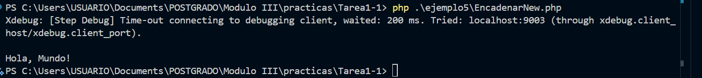

# Ejemplo 5

## Encadenar new sin Paréntesis para Clases Anónimas - PHP 8.4

| Aspecto     | Descripción |
|------------|------|
| Explicación Técnica        | Permite invocar un método inmediatamente después de instanciar una clase (incluidas las clases anónimas) sin requerir paréntesis para el constructor.   |
| Beneficios       | Mejora la legibilidad y fluidez del código, especialmente cuando se usa la instanciación de clases anónimas como parte de una cadena de métodos (Fluent Interface).   |
| Riesgos    | Podría introducir ambigüedad si no se usa con cuidado, pero la RFC (Request for Comments) está diseñada para mantener la claridad.   |
| Impacto Practico    | Calidad: Hace que el código que utiliza clases temporales (como en la manipulación de colecciones o builders) sea más conciso y expresivo.   |

### Antes vs. Después (Mejora del Código Legado)

Antes (Pre-PHP 8.4)	Después (PHP 8.4+)
```php
php $result = (new Collection([1, 2, 3]))->map(fn($x) => $x * 2)->get(); // Es necesario el paréntesis alrededor de la instanciación
$result = new Collection([1, 2, 3])->map(fn($x) => $x * 2)->get();	// Los paréntesis son opcionales
```
### Code

```php
<?php // PHP 8.4+
// Clase anónima utilizada como un 'builder'
$message = new class('World') {
    private string $name;

    public function __construct(string $name) {
        $this->name = $name;
    }

    public function greet(): string {
        return "Hello, " . $this->name . "!";
    }
}->greet(); // Acceso al método sin los paréntesis de la instanciación

echo $message . "\n";
assert($message === 'Hello, World!');

// Salida Esperada:
// Hello, World!
?>

```

### Salida del ejercicio




